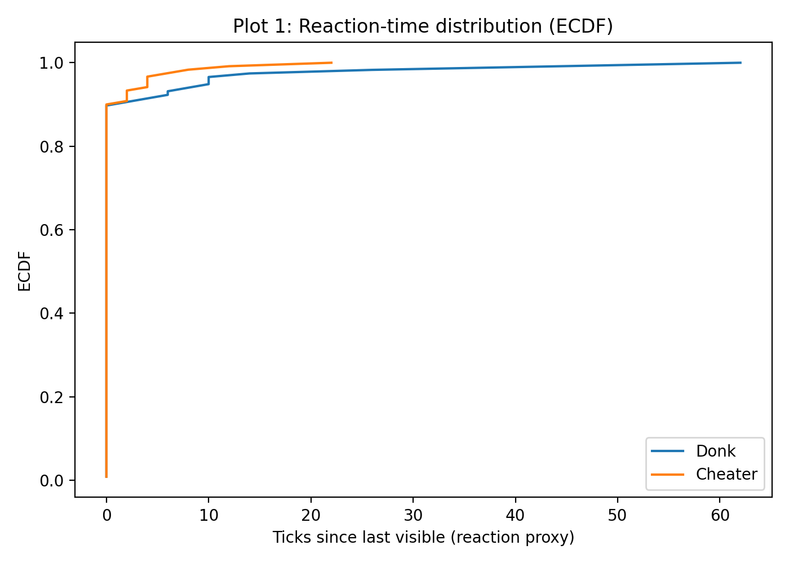
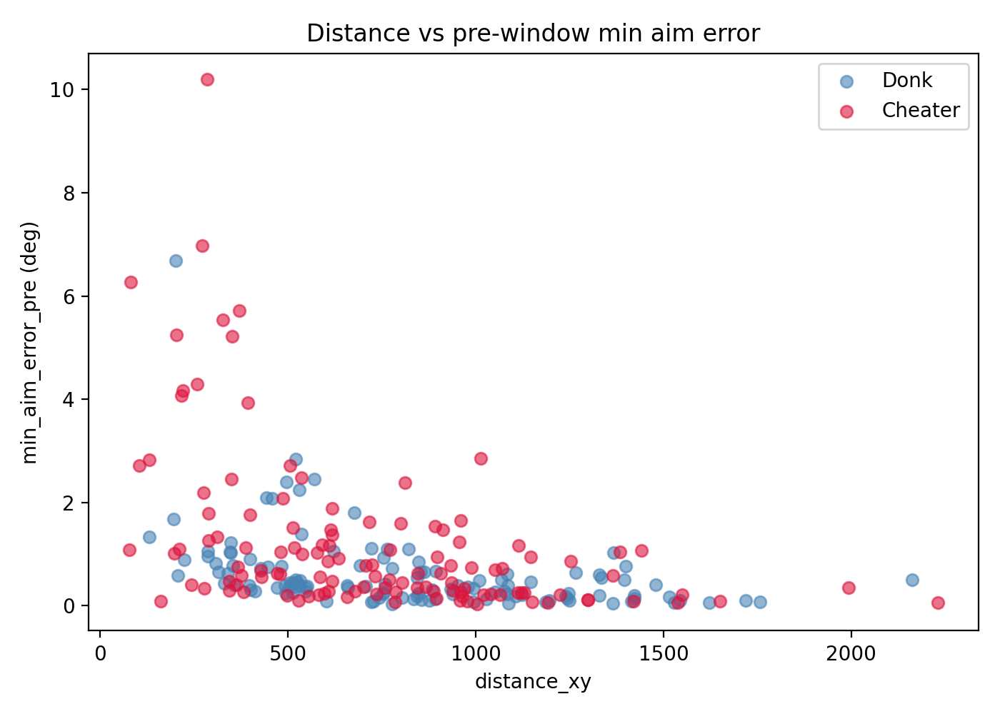
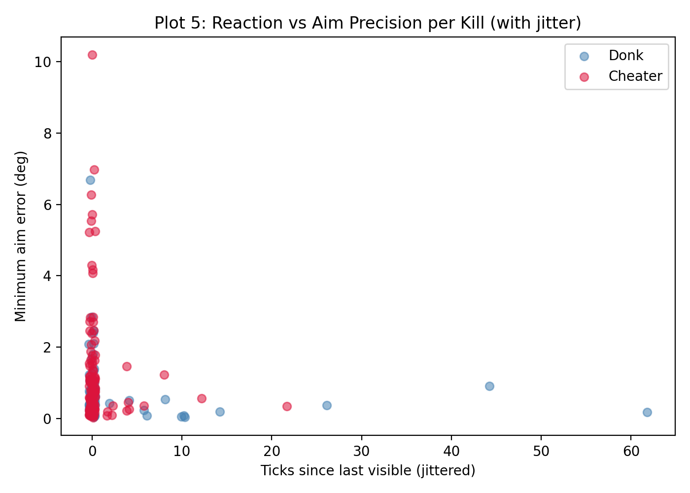
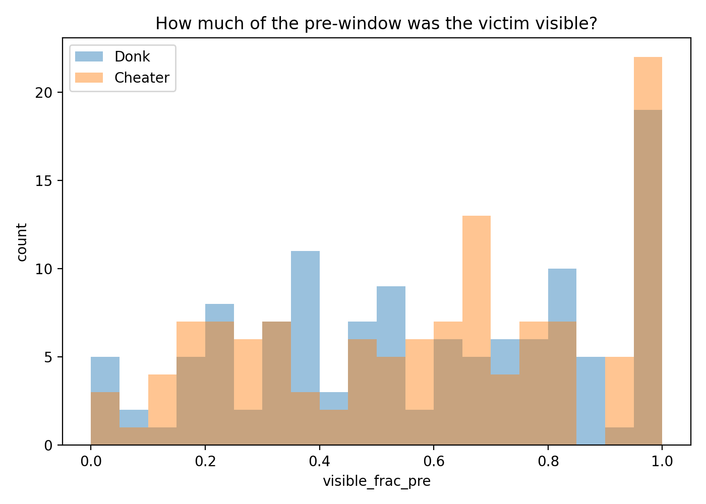
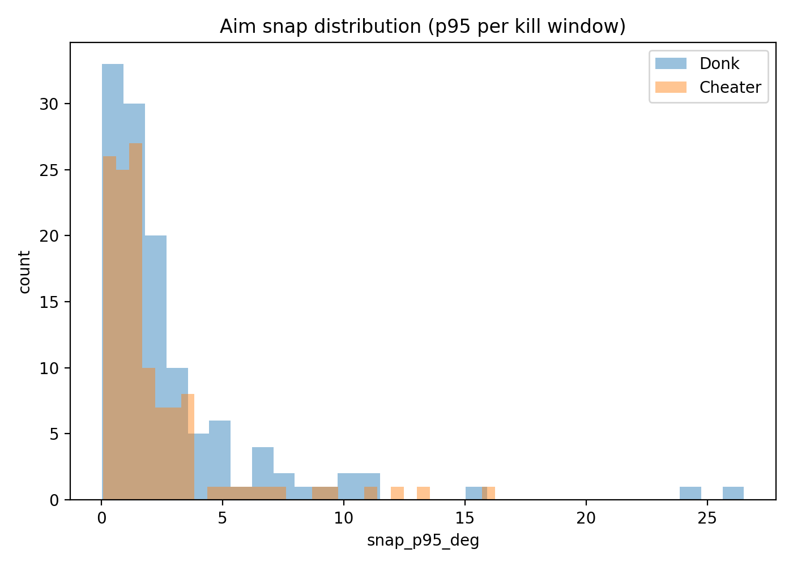

# Temporal CNN Experiments

This repo now includes an encounter-level temporal CNN baseline that scores fight windows and aggregates those scores back to the player level.

## What Changed

- `main/scripts/train_encounter_nn.py` defaults to `--model-type temporal_cnn`
- `main/src/models/encounter_nn.py` contains the temporal sequence model, preprocessing, aggregation, and inference scoring helpers
- encounter-level scores can be merged back into player features as stacked features for the final player-level model

## Current Status

The temporal CNN path is working and useful for research iteration, but it is not the current champion model. The stronger current public-safe story is:

- stacked encounter modeling matters
- legit hard negatives matter
- benchmark-driven evaluation matters more right now than blind architecture churn

## Why This Model Exists

The player-level model remains the top-level ranking model. The CNN sits underneath it and is intended to capture short temporal control patterns within individual encounters that are hard to preserve in aggregated tabular features alone.

Current structure:

1. Build encounter rows and temporal windows
2. Score each encounter with the temporal CNN
3. Aggregate encounter scores per player in a single demo
4. Merge those stacked features into the player-level model flow

## Public-Safe Experiment Plots

These plots are derived summaries only. They do not contain raw demos, filesystem paths, Steam IDs, or private artifacts.

### Reaction-Time ECDF



### Distance vs Pre-Window Minimum Aim Error



### Reaction vs Minimum Aim Error



### Visibility Before Shot Distribution



### Snap P95 Histogram



## Operational Notes

- Model artifacts remain intentionally ignored and should not be committed.
- Raw uploaded demos under `main/data/raw_uploads/` remain local-only.
- Use demo mode for any public frontend deployment.

## Training Entry Point

```powershell
python main/scripts/train_encounter_nn.py --train-data cs2cd --device cpu
```

For a quick smoke run:

```powershell
python main/scripts/train_encounter_nn.py --train-data cs2cd --max-demos 16 --epochs 3 --patience 1 --device cpu
```
