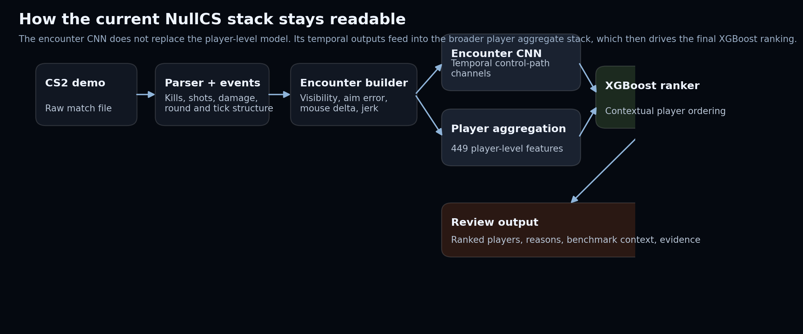
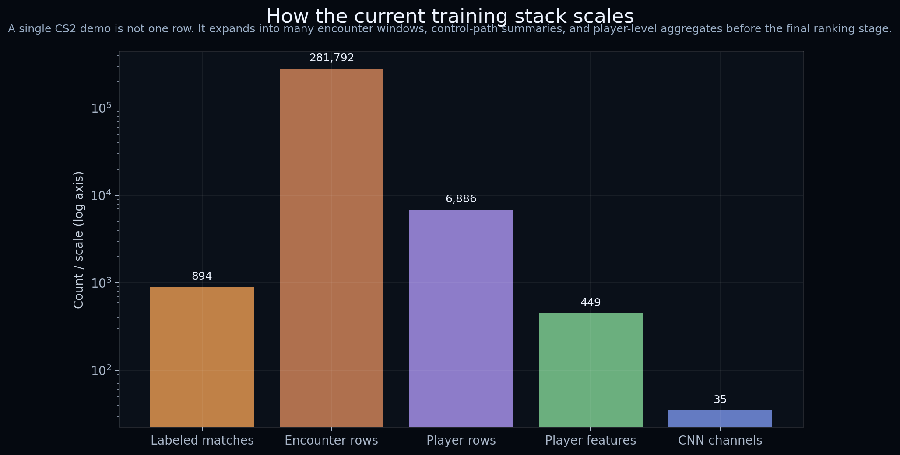

# Model

NullCS is a match-relative behavioral review pipeline.

It turns one `.dem` file into ranked player signals, supporting metrics, and explanation artifacts that help decide who should be inspected first.

## High-Level Pipeline

1. Parse tick-level demo data into structured match tables.
2. Build encounter-level and player-level behavioral features.
3. Generate stacked encounter signals.
4. Score players with a player-level ranking model.
5. Export ranked outputs and explanation artifacts for review.

## What The Features Try To Capture

- aim behavior
- target acquisition and shot timing
- movement and fight geometry
- visibility and low-information contexts
- input dynamics
- encounter sequencing

## Why Match-Relative Ranking

A strong legitimate player can look unusual in a weak lobby. A modest cheater can hide behind ordinary-looking headline stats. Match-relative ranking is a more honest framing for review support because it compares players inside the match before asking for deeper manual review.

## Review Flow

## Training Scale

## More Detail

- [Model stack](model_stack.html)
- [CNN experiments](cnn_experiments.html)
