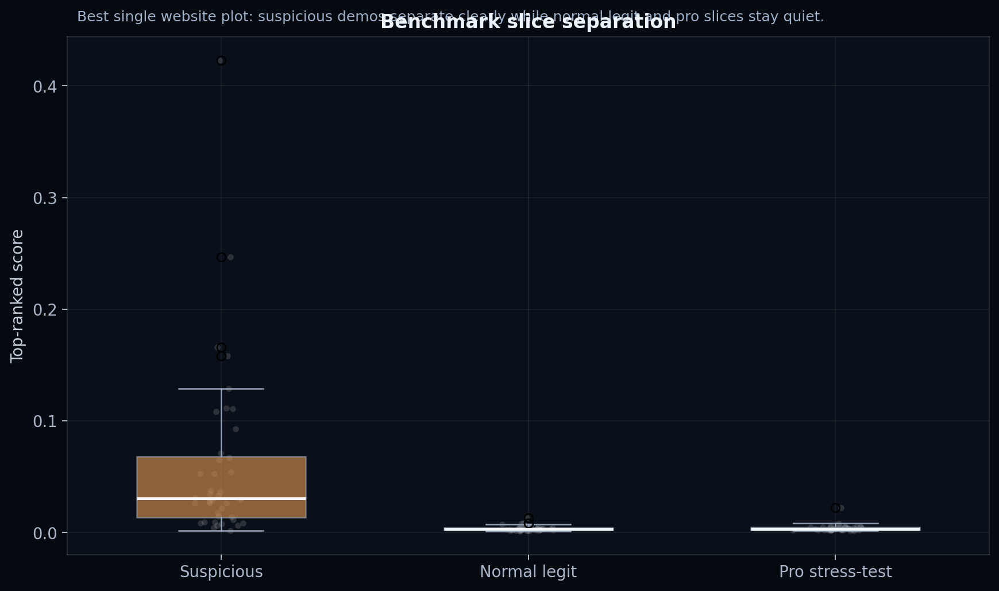
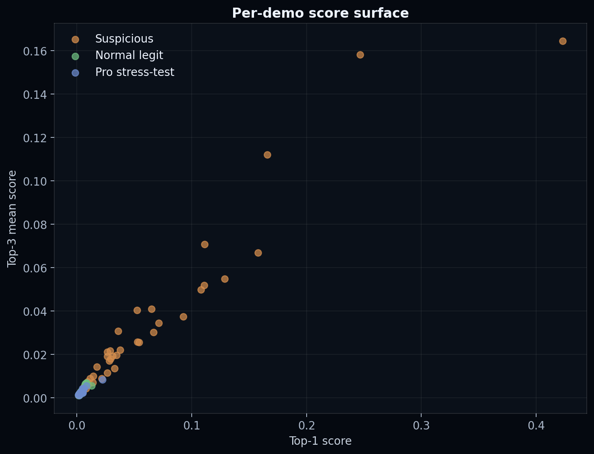

# Proof

This page is the short public-safe benchmark story for NullCS.

The central question is whether suspicious benchmark cases surface clearly while held-out legit and pro slices stay quiet. A useful review tool should point investigators toward the right player and provide supporting evidence without overreacting to strong legitimate play.

## Public Benchmark Read

Current public-safe summary values:

- suspicious benchmark median / mean top-ranked signal: `0.030 / 0.060`
- normal legit median / mean top-ranked signal: `0.0031 / 0.0037`
- pro stress-test median / mean top-ranked signal: `0.0034 / 0.0040`
- suspicious benchmark top-1 / top-3 retrieval: `0.575 / 0.875`

These are review signals, not enforcement thresholds.

## What Matters

- suspicious slices should surface clearly
- ordinary legit slices should stay quiet
- strong pro slices should also stay quiet

That shape is more useful than a louder model that also overreacts to strong legitimate players.

## Core Visuals

### Benchmark slice comparison

### Cheater retrieval summary

### Top-1 distribution

### Top-1 vs top-3 scatter

## Read More

- [Research snapshot](research_snapshot.html)
- [Benchmark methodology](benchmark_methodology.html)
