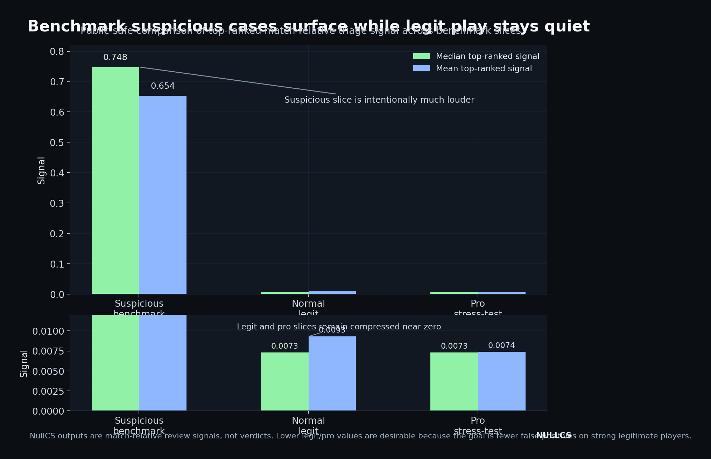
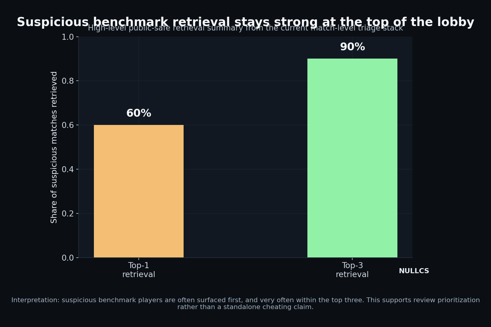

# Research Snapshot

NullCS is a behavioral analysis system for Counter-Strike match review. It is designed to help narrow analyst attention inside a single demo, not to act as an enforcement system or one-click verdict engine.

## What Changed Recently

- tightened training and inference parity around richer tick and input fields
- softened the interpretation layer so strong legitimate players are less likely to be overstated by the UI
- added pro-level hard negatives to improve real-world separation
- built a stacked encounter-model path for player-level ranking
- added a benchmark harness to compare held-out legit, pro stress-test, and cheater slices

## Current Benchmark Read

The current benchmark picture is intentionally simple:

- held-out normal legit demos stay very quiet
- pro stress-test demos also stay quiet
- cheater benchmark demos surface much more strongly at the top of the lobby

This means the current system behaves more like a match-relative anomaly and review-priority layer than an absolute cheat-probability model.

### Public-Safe Benchmark Numbers

Current public-safe summary values:

- suspicious benchmark median top-ranked signal: `0.748`
- suspicious benchmark mean top-ranked signal: `0.654`
- normal legit median top-ranked signal: `0.0073`
- normal legit mean top-ranked signal: `0.0093`
- pro stress-test median top-ranked signal: `0.0073`
- pro stress-test mean top-ranked signal: `0.0074`

High-level suspicious benchmark retrieval:

- top-1 retrieval: `0.60`
- top-3 retrieval: `0.90`

These are match-relative triage outputs, not verdicts. The important shape is that suspicious slices stay much louder while legit and pro slices remain compressed near zero.

### Benchmark Slice Comparison

### Cheater Retrieval Summary

## Model Direction

NullCS currently uses a player-level ranking model that can consume stacked encounter-level features. Two points matter:

- the stacked encounter path is useful and improves retrieval stability on benchmark slices
- the temporal CNN branch integrated successfully, but it is currently research infrastructure rather than the best-performing public-facing candidate

## Public Framing

What this repo is comfortable showing publicly:

- high-level benchmark slices
- research progress
- restrained experiment summaries

What stays private:

- raw demos and uploads
- processed local artifacts
- internal model files
- detailed feature manifests and sensitive operational logic

## Public Repo Positioning

The public repo stays aligned with the same core principles used throughout the project:

- research-first framing
- review support, not verdict language
- public-safe benchmark summaries
- conservative handling of sensitive data and implementation details

## Desktop Beta Note

The desktop application is being kept out of the public repo for now, but a desktop beta is planned for this summer. The public GitHub side is meant to show the research stack, benchmark behavior, and public-safe findings behind that product direction.
